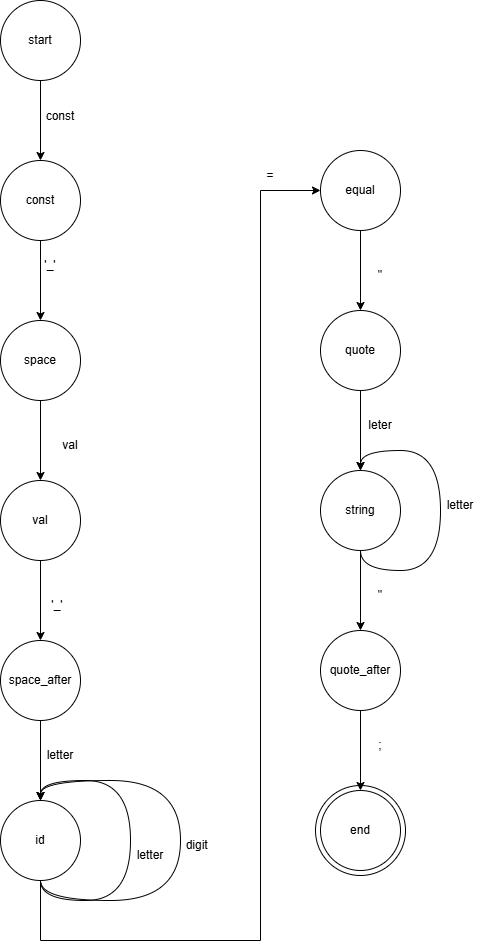
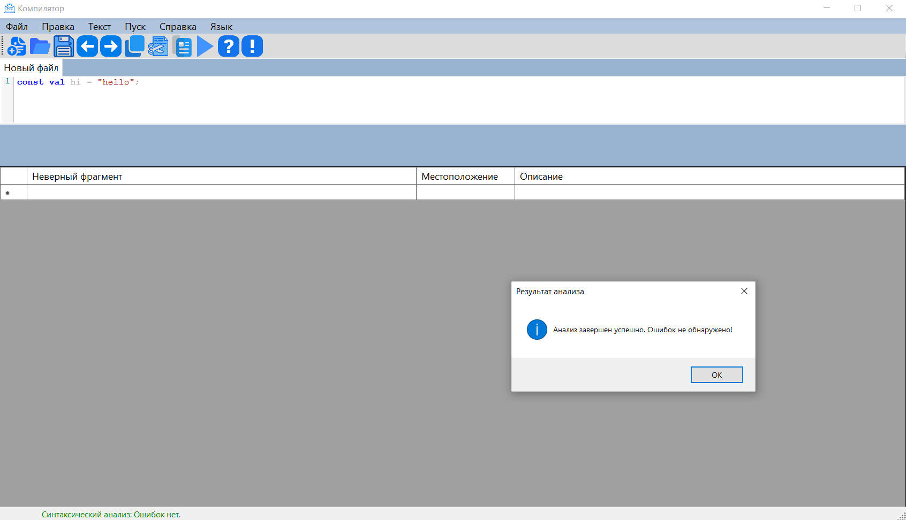
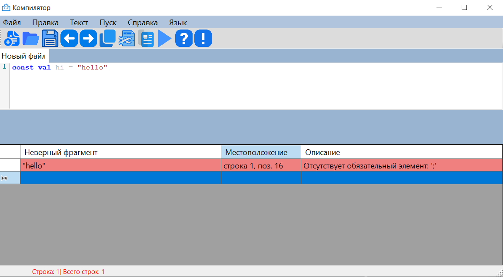
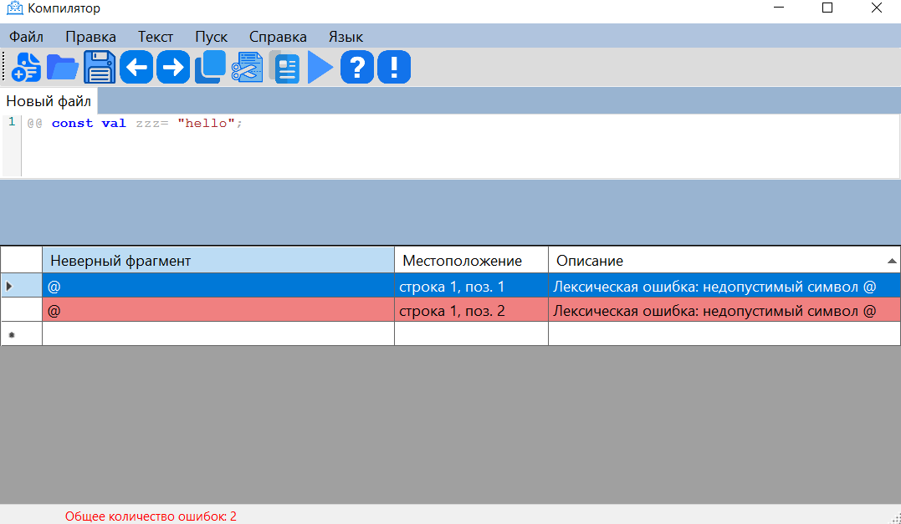
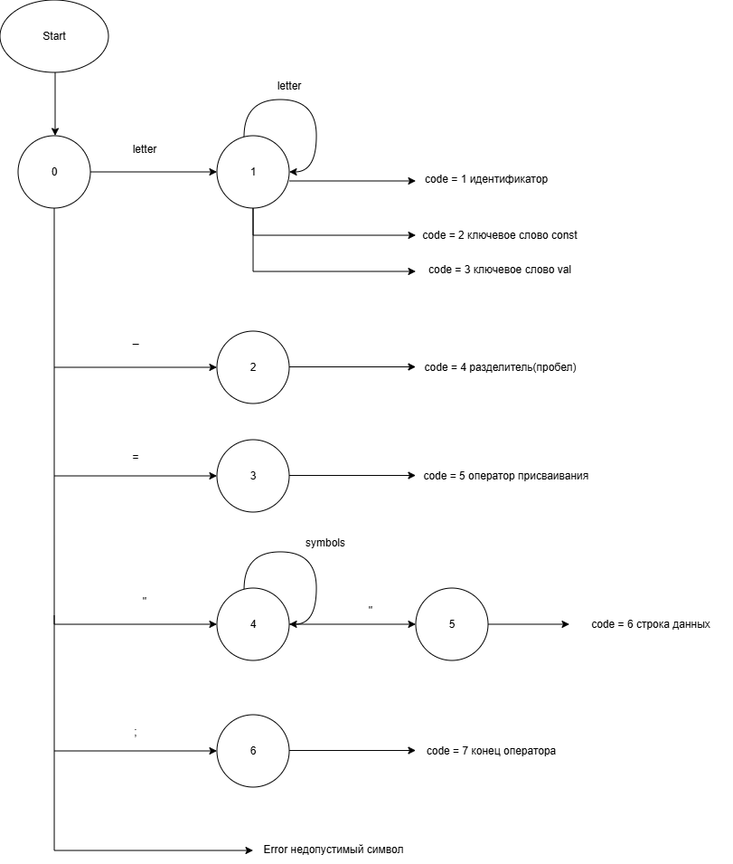
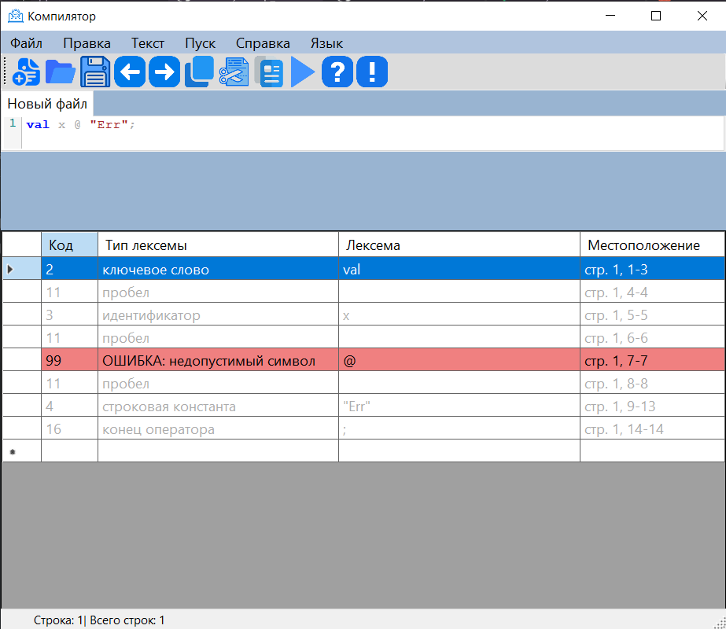
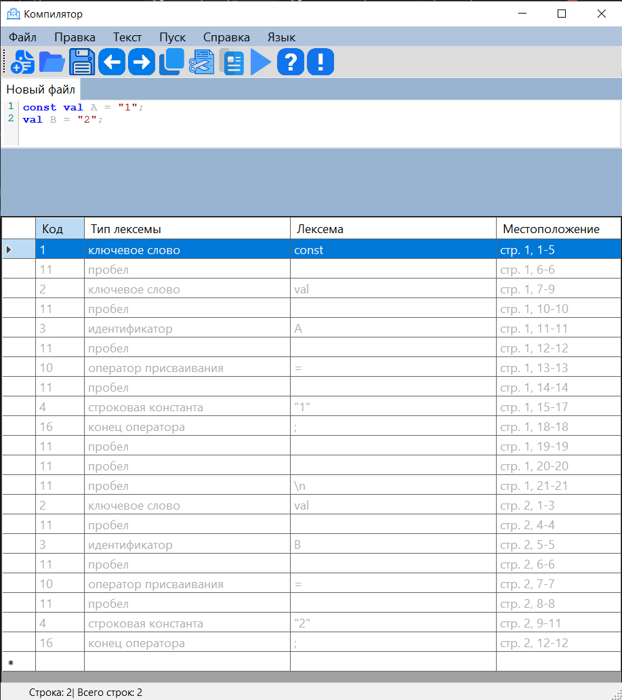

# Лабораторная работа: Разработка синтаксического анализатора (парсера)

## Цель работы
Изучить назначение и принципы работы синтаксического анализатора в структуре компилятора. Спроектировать грамматику, построить соответствующую схему метода анализа грамматики и выполнить программную реализацию парсера с нейтрализацией синтаксических ошибок методом Айронса. Интегрировать разработанный модуль в ранее созданный графический интерфейс языкового процессора.
## Сведения об авторе
* **Автор:** Обеленец Павел
* **Группа:** АВТ-313
* **Год:** 2026

---
## Основные требования:
1. Проектирование грамматики для синтаксической конструкции объявления констант.
2. Реализация алгоритма анализа (метод рекурсивного спуска).
3. Внедрение системы диагностики и нейтрализации ошибок по методу Айронса.
4. Обеспечение визуальной связи между таблицей ошибок и текстовым редактором (переход по клику).
---

## Вариант задания №61
**Тема:** Объявление и инициализация строковой константы на языке Kotlin.
**Пример конструкции:** `const val GREETING = "Hello World!";`

### Разработка грамматики
Формальное определение грамматики $G = (V_T, V_N, P, S)$:

* **Терминальные символы ($V_T$):
* **Нетерминальные символы ($V_N$):
* **Целевой символ ($S$):

**Правила вывода ($P$):**
1. <start> ->  'const' <const>
2.<const> ->  ' ' <space> 
3. <space> ->   'val' <val>
4. <val> -> ' ' <space_after >
5.<space_after >  letter <id>
6. <id> -> letter <id> | digit <id> | ‘_’ <id> | “=” <equal>
7. <equal> ->’ “ ’ <quote> 
8. <quote> -> letter <string> 
9. <string_ > -> letter <string> | ‘ “ ’ <quote_ second>
10. <quote_second> ->  ';' < end >

---
### Классификаця граматики 
---
### Метод анализа

---

---

### Диагностика и нейтрализация синтаксических ошибок
Для обработки некорректных входных данных реализован **метод Айронса**.

**Логика работы:**
* При обнаружении ошибки (например, отсутствие `;` или `=` ) анализатор фиксирует её в списке и переходит в режим поиска **опорного символа**.
* Опорными символами в данной грамматике выступают `;` (завершение текущей инструкции) или ключевое слово `const` (начало следующей инструкции).
* Анализатор игнорирует («пропускает») все последующие токены до тех пор, пока не встретит один из опорных символов, после чего восстанавливает нормальный процесс разбора.
* Это позволяет найти несколько ошибок за один проход, не прерывая работу программы после первой же неудачи.

---

### Тестовые примеры

#### Пример 1: Корректный ввод
* **Входная строка:** `const val hi = "hello";`

#### Пример 2: Синтаксическая ошибка (пропуск точки с запятой)
* **Входная строка:** `const val hi = "hello"`

#### Пример 3: Ошибка в идентификаторе
* **Входная строка:** `const val = "hello";`

### Перечень допустимых лексем

| Условный код | Тип лексемы | Описание / Регулярное выражение |
| :--- | :--- | :--- |
| **1** | Ключевое слово | `const` |
| **2** | Ключевое слово | `val` |
| **3** | Идентификатор | `GREETING` |
| **4** | Строковая константа | `"Hello"` (текст в двойных кавычках) |
| **10** | Оператор присваивания | `=` |
| **16** | Конец оператора | `;` |
| **11** | Пробельные символы | Пробел, табуляция, перенос строки (`\n`) |
| **99** | Ошибка | Любой символ, не попавший в категории выше |

---

## Диаграмма состояний
Для работы сканера реализован конечный автомат, который посимвольно анализирует входную строку.

**Краткое описание работы автомата:**
* **S0 (Начальное):** Определяет тип первого символа лексемы.
* **S1 :** Накапливает буквы и цифры. По завершении происходит проверка по словарю ключевых слов (`const`, `val`) или же идентификатор.
* **S2 :** Разделитель (пробел).
* **S3 :** Оператор присваивания.
* **S4 :** Состояние внутри кавычек. Выход возможен только при встрече закрывающей кавычки.
* **S5 :** Состояние при котором получается строка данных
* **S6 :** точка с запятой - окончание оператора .
* **S (Ошибка):** Состояние фиксации некорректного символа или прерывания строки.

---

## Тестовые примеры

### 1. Корректная строка
**Вход:** `const val msg = "Hi";`

### 2. Строка с ошибкой (недопустимый символ)
**Вход:** `val x @ "Err";`

### 3. Многострочный пример
**Вход:** `const val A = "1";`
`val B = "2";`

---

## Описание проекта
Разработан оконный текстовый редактор с поддержкой вкладок и разделением рабочего пространства. 

**Интерфейс разделен на четыре ключевые области:**
1.  **Главное меню:** Полный доступ ко всем командам программы.
2.  **Панель инструментов:** Кнопки с иконками для быстрого вызова функций.
3.  **Область редактирования:** Поле для работы с текстом (кодом).
4.  **Область вывода:** Панель только для чтения, предназначенная для отображения результатов работы языкового процессора.

---

## Используемые технологии
* **Язык программирования:** C#
* **Фреймворк:** Windows Forms (WinForms)
* **Среда разработки:** Rider
* **Платформа:** .NET

---

## Инструкция по сборке и запуску

### Установка зависимостей
Приложение является самодостаточным и не требует установленной среды разработки (IDE). 
* Необходим установленный **.NET Desktop Runtime** (версия 6.0 или выше).

### Запуск приложения
Приложение поставляется в виде готового исполняемого файла (`.exe`):
1.  Перейдите в папку с программой.
2.  Запустите файл: `CompilerApp.exe` (название может варьироваться в зависимости от имени проекта).

---

## Описание интерфейса и функций (Руководство пользователя)

### Основные элементы управления
Все функции дублируются тремя способами: через меню, кнопки на панели и горячие клавиши.

#### 1. Работа с файлами (Меню «Файл»)

| Функция | Способ вызова | Описание |
| :--- | :--- | :--- |
| **Создать** | Кнопка «Создать» / `Ctrl + N` | Открывает новую пустую вкладку. |
| **Открыть** | Кнопка «Открыть» / `Ctrl + O` | Загружает текст из файла с диска. |
| **Сохранить** | Кнопка «Сохранить» / `Ctrl + S` | Перезаписывает текущий файл. |
| **Сохранить как** | Пункт меню «Сохранить как» | Сохраняет текст в новый файл. |
| **Выход** | Пункт меню «Выход» | Закрывает приложение с подтверждением сохранения. |

#### 2. Редактирование (Меню «Правка»)
* **Отмена / Повтор** (`Ctrl+Z` / `Ctrl+Y`): Управление историей изменений.
* **Копировать / Вырезать / Вставить**: Стандартная работа с буфером обмена.
* **Удалить** (`Del`): Удаление выделенного фрагмента текста.
* **Выделить все** (`Ctrl+A`): Мгновенное выделение всего текста в активной вкладке.

#### 3. Дополнительные возможности
* **Drag-and-Drop:** Возможность открыть файл, просто перетащив его из папки в окно редактора.
* **Масштаб:** Изменение размера текста с помощью `Ctrl` + колесо мыши.
* **Смена языка:** Переключение интерфейса (RU/EN) в меню «Язык».
* **Справка** (`F1`): Вызов данного руководства и окна «О программе».

---

## Ограничения и особенности
* **Окно вывода:** Область в нижней части экрана защищена от записи пользователем — она предназначена только для системных сообщений.
* **Динамический интерфейс:** Возможность изменять размеры областей, перетаскивая границы разделителей. Полосы прокрутки появляются автоматически.
