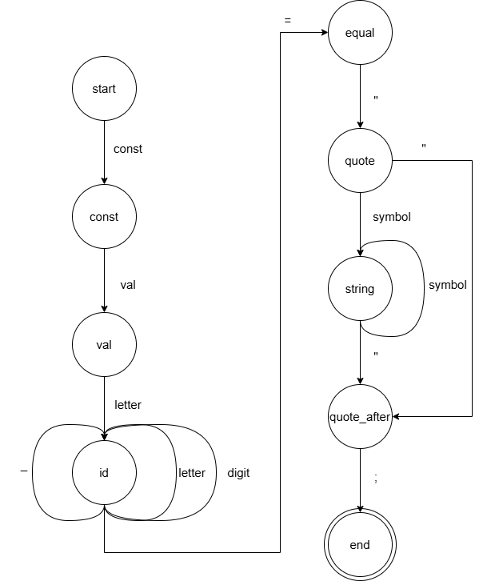

# Лабораторная работа: Разработка синтаксического анализатора (парсера)

## Цель работы
Изучить назначение и принципы работы синтаксического анализатора в структуре компилятора. Спроектировать грамматику, построить соответствующую схему метода анализа грамматики и выполнить программную реализацию парсера с нейтрализацией синтаксических ошибок методом Айронса. Интегрировать разработанный модуль в ранее созданный графический интерфейс языкового процессора.
## Сведения об авторе
* **Автор:** Обеленец Павел
* **Группа:** АВТ-313
* **Год:** 2026

---
## Основные требования:
1. Проектирование грамматики для синтаксической конструкции объявления констант.
2. Реализация алгоритма анализа (метод рекурсивного спуска).
3. Внедрение системы диагностики и нейтрализации ошибок по методу Айронса.
4. Обеспечение визуальной связи между таблицей ошибок и текстовым редактором (переход по клику).
---

## Вариант задания №61
**Тема:** Объявление и инициализация строковой константы на языке Kotlin.
**Пример конструкции:** `const val GREETING = "Hello World!";`

## Разработка грамматики
Формальное определение грамматики $G = (V_T, V_N, P, S)$:

* **Терминальные символы $V_T$ = {a, b, ..., z, A, B, ..., Z, 0, 1, ...,9, +, -, /, *, {, }, (, ), ;, _}
* **Нетерминальные символы $V_N$= ```{<start> , <const>, <val>, <equal>, <id>, <quote>, <string>, <quote_second>}```
* **Целевой символ $Z$ = < start >
- symbol ∈ V_T
- digit -> '0' | '1' | ... | '9'
- letter -> 'a' | 'b' | ... | 'z' | 'A' | 'B' | ... | 'Z'
- Z = < start >

**Правила вывода $P$:**
```
1. <start> ->  'const ' <const>
2.<const> ->  'val ' <val>
3. <val> -> letter <id>
4. <id> -> letter <id> | digit <id> | ‘_’ <id> | “=” <equal>
5. <equal> ->’ “ ’ <quote> 
6. <quote> -> symbol <string> | ‘ “ ’ <quote_ second>
7. <string > -> symbol <string> | ‘ “ ’ <quote_ second>
8. <quote_second> ->  ';' 
```
---
## Грамматика ANTLR
```
startRule : CONST_KW VAL_KW id EQUAL string_literal SEMI EOF ;

id : ID ;
string_literal : STRING ;

CONST_KW : 'const' ;
VAL_KW   : 'val' ;
EQUAL    : '=' ;
SEMI     : ';' ;

ID : LETTER (LETTER | DIGIT | '_')* ;

STRING : '"' SYMBOL* '"' ;

fragment LETTER : [a-zA-Z] ;
fragment DIGIT  : [0-9] ;

fragment SYMBOL : [a-zA-Z0-9+\-/*{}();_] ;

WS : [ \t\r\n]+ -> channel(HIDDEN) ;
```
---

## Классификаця граматики 
Грамматика относится к регулярным (автоматным) грамматикам, поскольку все её правила имеют праволинейную форму A -> aB | a | e и допускают эквивалентное представление в виде детерминированного конечного автомата. Конструкция не содержит вложенности и обрабатывается последовательным переходом между состояниями.

---
## Метод анализа

Для работы алгоритма синтаксического анализа реализован граф автоматной грамматики.


---


---

## Диагностика и нейтрализация синтаксических ошибок
Для обработки некорректных входных данных реализован **метод Айронса**.

**Логика работы:**
* При обнаружении ошибки (например, отсутствие `;` или `=` ) анализатор фиксирует её в списке и переходит в режим поиска **опорного символа**.
* Опорными символами в данной грамматике выступают `;` (завершение текущей инструкции) или ключевое слово `const` (начало следующей инструкции).
* Анализатор игнорирует («пропускает») все последующие токены до тех пор, пока не встретит один из опорных символов, после чего восстанавливает нормальный процесс разбора.
* Это позволяет найти несколько ошибок за один проход, не прерывая работу программы после первой же неудачи.

---

## Тестовые примеры

#### Пример 1: Корректный ввод
* **Входная строка:** `const val hi = "hello";`


#### Пример 2: Синтаксическая ошибка (пропуск точки с запятой)
* **Входная строка:** `const val hi = "hello"`


#### Пример 3: Недопустимые символы
* **Входная строка:** `@@const val zzz = "hello";`


### Перечень допустимых лексем

| Условный код | Тип лексемы | Описание  |
| :--- | :--- | :--- |
| **1** | Ключевое слово | `const` |
| **2** | Ключевое слово | `val` |
| **3** | Идентификатор | `GREETING` |
| **4** | Строковая константа | `"Hello"` (текст в двойных кавычках) |
| **10** | Оператор присваивания | `=` |
| **16** | Конец оператора | `;` |
| **99** | Ошибка | Любой символ, не попавший в категории выше |

---


